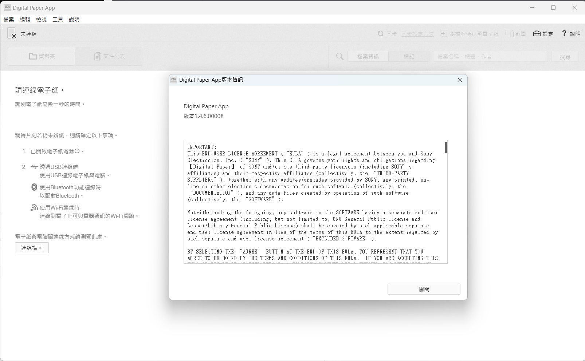

## Sony Digital Paper App 繁體中文翻譯
鑒於Sony Digital Paper App在繁體中文環境下還是會以簡體中文顯示，此處翻譯了一份繁體中文翻譯檔供大家使用。  

__本儲存庫不會提供修改好的二進位檔案，請自行按照步驟修改__

### 修改方式
需要先安裝[node.js](https://nodejs.org/)環境以使用asar包裝工具。  
接下來要安裝[asar包裝工具](https://github.com/electron/asar)，請照著裡面的指示安裝。  
找到Sony Digital Paper App的程式檔，是以asar格式包裝的網頁，通常位於
```C:\Program Files (x86)\Sony\Digital Paper App\DigitalPaperApp\resources\app.asar```  
請將其複製到其他地方以供拆解。  
接下來用node.js執行asar工具，安裝完的asar主程式通常會在  
```%USERPROFILE%\node_modules\@electron\asar\bin\asar.js```  
執行以下拆解指令：
```
node %USERPROFILE%\node_modules\@electron\asar\bin\asar.js extract app.asar app
```
記得將檔案名稱與位置自行替換成自己的。  
將這個repo中的`messages.zh-TW.json`複製到`app\res\locales\messages.zh-TW.json`  
將這些檔案打包回去，考慮以下指令：
```
node %USERPROFILE%\node_modules\@electron\asar\bin\asar.js pack app app.asar
```
檔案名稱與路徑也記得換成自己的，接下來就將修改完的`app.asar`複寫回原本拿出來的地方，舊版的記得備份，免得損毀。

### 翻譯
用openCC翻譯+轉換詞彙，再人工修正，有可能會有轉換錯誤或是沒被轉換的漏網之魚，歡迎丟issues或是發pr進來。  
目前提供的翻譯檔案適用於Digital Paper App 1.4.6.00008版，其他版本不保證可以完全相容。

### 聲明
本翻譯僅供學術研究參考用途。